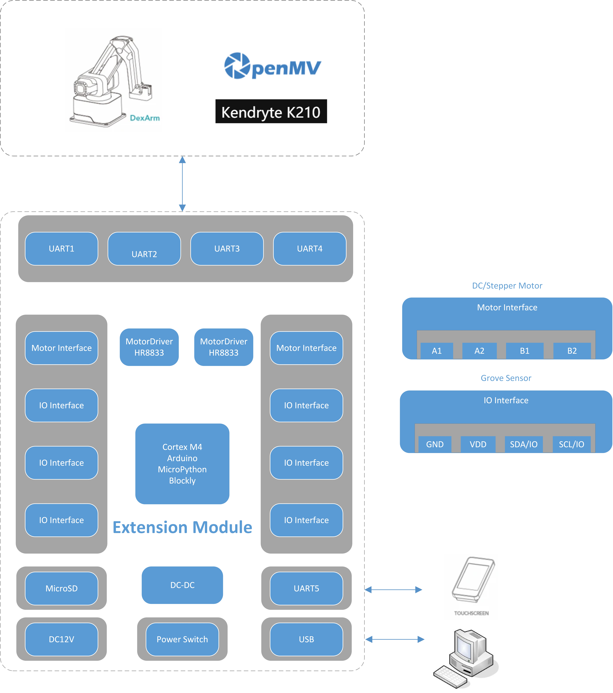

# Extension Module For Dexarm

# Overview
Arduino-based Extension Module For Dexarm.

It is intended for support more motors, sensors, and support Arduino, MicroPython, Blockly programming.
- Cortex M4
- 4 x DC Motors or 2 x Stepper Motors
- 4 x IO Interface, GPIO, IIC, PWM(Compatible with Grove Sensor)
- 4 x UART, support DexArm, Vision kit such as Open MV, K210, etc
- 1 x UART For TouchScreen or ESP32 Wireless Module
- 1 x USB CDC For Programming and Communication interface
- MicroSD
- DC12V 4A In

Audio Codec Chip
Dual Microphones on board
Headphone output
2 x 3-watt Speaker output
Dual Auxiliary Input
MicroSD Card slot (1 line or 4 lines)
Six buttons (2 physical buttons and 4 touch buttons)
JTAG header
Integrated USB-UART Bridge Chip
Li-ion Battery-Charge Management

The block diagram below presents main components of the Extension Module and interconnections between components.

!Note: This is the init version of the definition, the final function parameters please refer to the purchase introduction.
